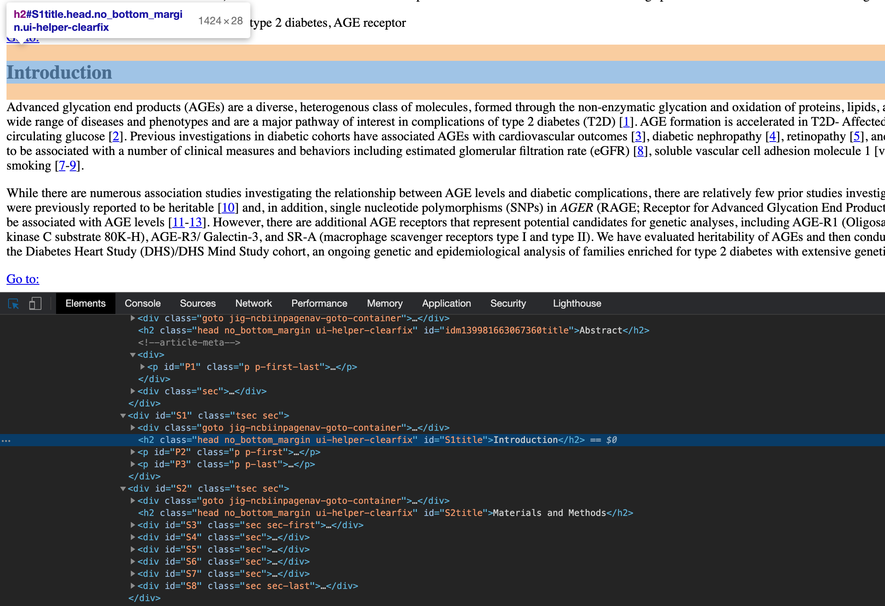
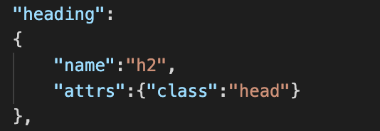

# AutoCORPus: Automated and Consistent Outputs from Research Publications

## Getting Started

### Single File
`$FILEPATH` indicates the PubMed HTML file that will be processed
`$TARGET_DIR` indicates the target directory for the output JSON files
`$CONFIG` indicates the configuration file 

    python run_app.py -f $FILEPATH -t $TARGET_DIR -c $CONFIG

If associated data is available, use `$ASSOCIATED_DATA` to indicate the directory that contains associated data, and use `-a` or `--associated_data` command

    python run_app.py -f $FILEPATH -t $TARGET_DIR -c $CONFIG -a $ASSOCIATED_DATA

If multiple configuration files are used, use `$CONFIG_DIR` for the directory of configuration files, and use

    python run_app.py -f $FILEPATH -t $TARGET_DIR -d $CONFIG_DIR

### Multiple Files
`$BASE_DIR` indicates the PubMed HTML file that will be processed
`$TARGET_DIR` indicates the target directory for the output JSON files
`$CONFIG` indicates the configuration file 

    python run_app_batch.py -b $BASE_DIR -t $TARGET_DIR -c $CONFIG

If multiple configuration files are used, use `$CONFIG_DIR` for the directory of configuration files, and use

    python run_app_batch.py -b $BASE_DIR -t $TARGET_DIR -d $CONFIG_DIR

### Configurations

Configuration files are needed to adjust for many different formats from publishers and websites. If the configuration files provided result in missing information, create a new configuration file that works.

1. Open the HTML document in any browser and use **inspect**/**inspection tool** (you can do this with text editor but insepection tool is easier)

2. Find the corresponding element in the HTML script
    
   - In Chrome, when selecting an element in HTML, the corresponding section in the page will be highlighted. Here, heading **Introduction** is being selected

    
    
3. Find the unique HTML tag and class attribute for the element

    - In the HTML snipet, the corresponding element name for the heading is **h2**, the class attribute is **head**, and the id attribute is **"S1title"**

            <h2 class="head no_bottom_margin ui-helper-clearfix" id="S1title">Introduction</h2>

4. Create a new configuration JSON file with the same structure, and fill in the correct **"name"** and **"attrs"** using element name and attributes found in previous step

    - In the corresponding **"heading"** key, the element **"name"** is **"h2"**. 
    - For **"attrs"**, usually **"class"** attribute alone is enough to identify all headings. If the **"class"** is missing, **null** should be used. Note that the **id** attribute **"S1title"** is not used here, because other headings in the document will have different **id** value
    

5. Repeat the same for other sections, until all elements in the page are correctly configured and can be found by AutoCORPus
